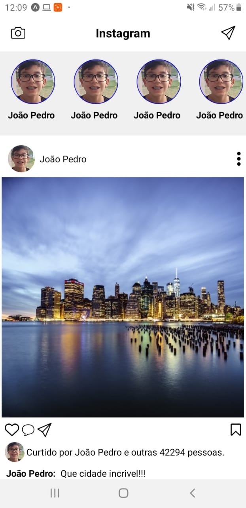

# Ui clone 📷Instagram 📱

## Feito por 👨‍💻[João Pedro Resende](https://www.linkedin.com/in/jpresdev)🚀

# Apresentação📄

Ui clone do app mobile do @instagram feito com React Native e as alguns conceitos da tecnologia como:


* Componentes funcionais
* Propriedades
* Css in js

# Tecnologias Utilizadas💻

* JavaScript 
* React Native
* Expo

# Projeto

<h2 style="color:#f5f5f5;">Spoiler👀</h2>

</img>

## Instruções📄
Caso queira ver como ficou o projeto em tempo real siga estes passos:

1. Instale no seu celular o aplicativo do [Expo](https://play.google.com/store/apps/details?id=host.exp.exponent&hl=pt_BR)
1. Abra este link [Clique aqui😉](https://expo.io/@jpresende/instagram-clone)
1. Escaneie o **QR code** do site acima com o aplicativo oficial do expo

# Contribuição✨
1. Realize um Fork do projeto Crie um branch com a nova feature 
```bash
git checkout -b feature/feature
```
2. Faça o Commit
```bash
git commit -m 'Add some feature'
```
3. Realize o Push no Branch
```bash
git push origin feature/feature
```
4. Abra um Pull Request
5. Deixe o Follow e a Star✨!!
